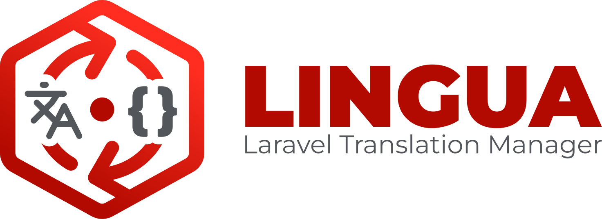
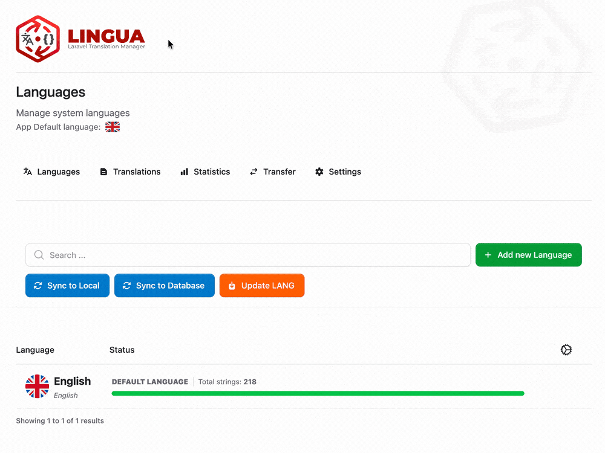
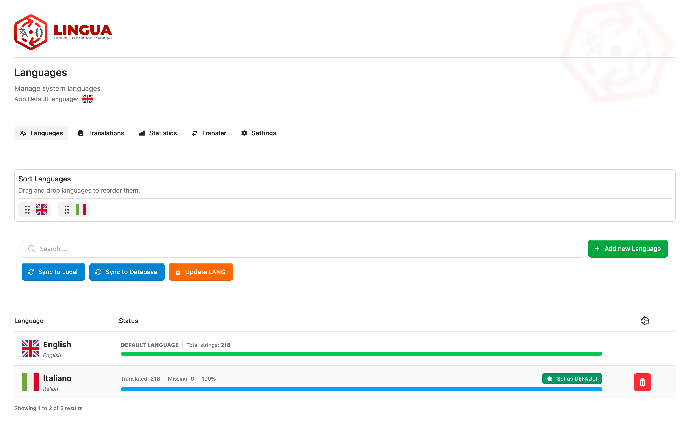
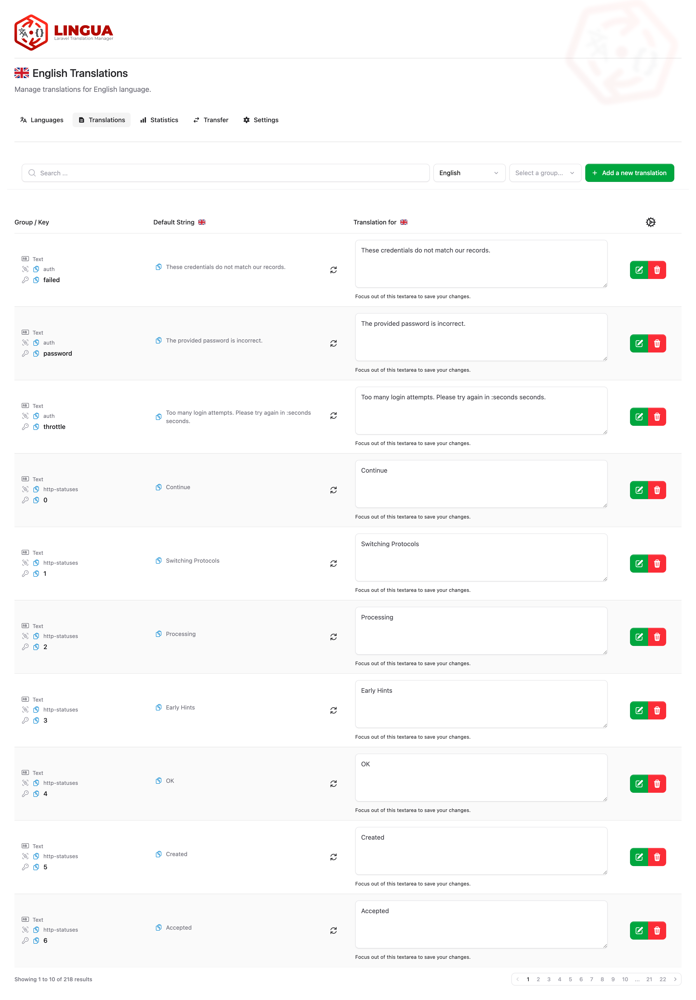
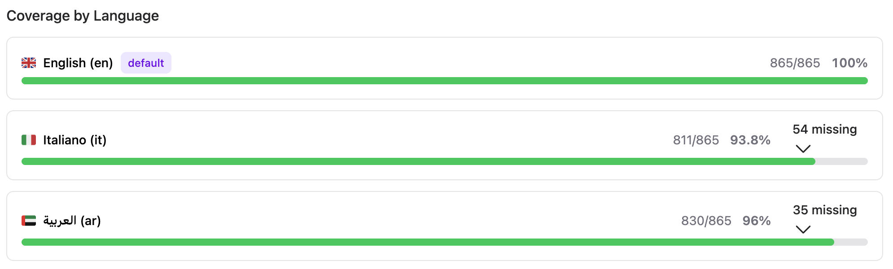
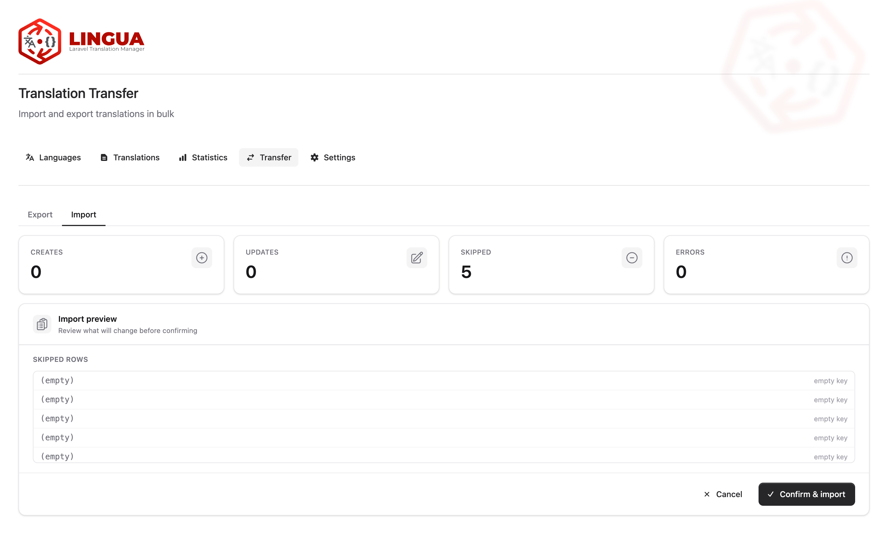
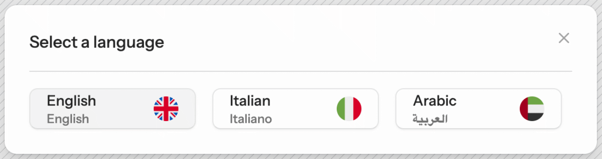

<div align="center">

<a href="https://rivalex.github.io/lingua-docs/" target="_blank" style="margin: 30px 0 50px !important;">
<figure>

</figure>
</a>

---

### **The complete multilingual management system for Laravel**

[](https://packagist.org/packages/rivalex/lingua)
[](https://php.net)
[](https://laravel.com)
[](LICENSE.md)
[](https://codecov.io/github/rivalex/lingua)
[](https://github.com/rivalex/lingua/actions/workflows/run-tests.yml)

<br>



<br>

**Lingua** is a self-hosted translation management package for Laravel — a native, database-driven alternative to
tools like Weblate, Locize, Lokalise, Crowdin, and SimpleLocalize, and a drop-in replacement for
`spatie/laravel-translation-loader` and `laravel-lang/common`. If you need to manage translations in a Laravel
application without depending on an external SaaS or downloading third-party language packages, Lingua gives you a
complete Livewire admin UI to edit, organize, import, export, and synchronize your i18n / l10n strings directly inside
your app.

Built on the TALL stack (Tailwind, Alpine, Livewire), Lingua stores translations in either your **database** or your
native `lang/` **files** — switchable with a single config value. It ships a bundled dataset of 26 locales aligned to
Laravel 13 (no `laravel-lang` required), handles published vendor translations safely, supports **CSV, JSON, XLSX, and
ODS** import/export with a mandatory dry-run preview, offers full RTL support, and can optionally AI-translate missing
strings via Lingua Pro. Built for **Laravel 11–13, Livewire 4, and PHP 8.3+**.

[Features](#-features) · [Installation](#-installation) · [Configuration](#-configuration) · [Storage Drivers](#-storage-drivers) · [Artisan Commands](#-artisan-commands) · [Publishing](#-publishing) · [UI Guide](#-ui-guide) · [Import / Export](#-import--export) · [Language Selector](#-language-selector) · [Facade](#-lingua-facade) · [Architecture](#-architecture) · [Lingua Pro](#-lingua-pro)

</div>

---

<div align="center">

## [Official Documentation](https://rivalex.github.io/lingua-docs/)

</div>

---

## ✨ Features

| Feature                          | Description                                                                                      |
|----------------------------------|--------------------------------------------------------------------------------------------------|
| **Database-backed translations** | All translations stored in the database, editable instantly without deployments                  |
| **File-mode driver**             | Optional file-mode stores translations directly in lang/ PHP/JSON files — no database required   |
| **Livewire UI**                  | Reactive, real-time language and translation management interface                                |
| **Flux UI components**           | Modern, accessible UI built with Livewire Flux                                                   |
| **Bi-directional sync**          | Push translations to the database or pull them back to local PHP/JSON files                      |
| **Import / Export**              | Export and import translations as CSV, JSON, XLSX, or ODS; bilingual and multi-locale scopes     |
| **Bundled translation dataset**  | 26 locales × 7 groups (5 902 strings) aligned to Laravel 13 — provisioned at locale install-time |
| **Rich text support**            | Translations can be plain text, HTML, or Markdown                                                |
| **Language selector**            | Configurable sidebar, dropdown, modal, or headless language switcher                             |
| **Translation statistics**       | Per-language coverage with progress bars, group breakdown, and missing-key drill-down            |
| **Shared navigation menu**       | Built-in nav bar on all admin pages; active-page highlighting; toggleable                        |
| **DB-persisted settings**        | Selector mode, flags, nav, editor toolbar managed from the UI                                    |
| **Headless language selector**   | Zero-CSS semantic HTML component for full styling freedom                                        |
| **RTL support**                  | First-class right-to-left language handling                                                      |
| **Vendor translations**          | Manage package translations alongside your own                                                   |
| **Authorization gate**           | Role-based access control via `LINGUA_GATE` env and Laravel Gates                                |
| **Database-agnostic**            | Full support for SQLite, MySQL, PostgreSQL, and SQL Server                                       |
| **Safe uninstall**               | `lingua:uninstall` exports translations before removing tables and published files               |
| **Lingua Facade**                | Fluent programmatic API for reading, writing, and managing languages and translations            |
| **Flexible routing**             | Route prefix/suffix config, optional gate, layout override, `wire:navigate` toggle               |
| **Lingua Pro**                   | Optional add-on: AI translation, translation memory, glossary, usage analytics                   |
| **Fully tested**                 | 780+ tests with Pest, covering commands, Livewire components, Blade, helpers, and facade         |

---

## 📦 Requirements

- PHP **8.3+**
- Laravel **11 | 12 | 13**
- Livewire **4.1+**
- Livewire Flux **2.12+**

**Optional:**

- `openspout/openspout` — required for XLSX and ODS import/export
- `rivalex/lingua-pro` — AI translation, translation memory, glossary, and analytics

---

## 🚀 Installation

### 1. Install via Composer

```bash
composer require rivalex/lingua
```

### 2. Run the interactive installer

```bash
php artisan lingua:install
```

The installer will:

- Prompt you to choose a storage driver: **database** (recommended) or **file**
- Publish `config/lingua.php`
- Publish and run the database migrations (driver-aware: file mode skips the `language_lines` table)
- Seed the database with your default language and its bundled translations (database mode)
- Or write default lang/ files (file mode)

After installation, set `LINGUA_STORAGE_DRIVER=database` (or `file`) in your `.env` and run `php artisan config:clear`.

### 3. Access the UI

| Page         | URL                                           | Route name            |
|--------------|-----------------------------------------------|-----------------------|
| Languages    | `your-app.test/lingua/languages`              | `lingua.languages`    |
| Translations | `your-app.test/lingua/translations/{locale?}` | `lingua.translations` |
| Statistics   | `your-app.test/lingua/statistics`             | `lingua.statistics`   |
| Settings     | `your-app.test/lingua/settings`               | `lingua.settings`     |
| Transfer     | `your-app.test/lingua/transfer`               | `lingua.transfer`     |

---

## ⚙️ Configuration

After installation, `config/lingua.php` gives you full control:

```php
return [

    // -------------------------------------------------------------------------
    // LOCALE DEFAULTS
    // -------------------------------------------------------------------------

    // Directory where local language files are stored
    'lang_dir'         => lang_path(),
    'default_locale'   => config('app.locale', 'en'),
    'fallback_locale'  => config('app.fallback_locale', 'en'),
    'session_variable' => 'locale',

    // -------------------------------------------------------------------------
    // ROUTING
    // -------------------------------------------------------------------------

    // Middleware applied to Lingua's management routes (auth required by default)
    'middleware' => ['web', 'auth'],

    // Optional: restrict access via a Laravel Gate
    // When set, 'can:{gate}' is added to admin routes.
    'gate' => env('LINGUA_GATE', null),

    // URL prefix for Lingua's management pages
    'routes_prefix' => 'lingua',

    // Optional URI fragment appended to every Lingua page route.
    // Useful for multi-tenant routing, e.g. '{team?}'.
    'routes_extra_parameters' => null,

    // -------------------------------------------------------------------------
    // UI / PRESENTATION
    // -------------------------------------------------------------------------

    // Language selector widget
    'selector' => [
        'mode'       => 'sidebar',   // 'sidebar' | 'modal' | 'dropdown' | 'headless'
        'show_flags' => true,
    ],

    // Rich-text editor toolbar options (overridable from the Settings UI)
    'editor' => [
        'headings'      => false,
        'bold'          => true,
        'italic'        => true,
        'underline'     => true,
        'strikethrough' => false,
        'subscript'     => true,
        'superscript'   => true,
        'blockquote'    => false,
        'code-line'     => false,
        'code-block'    => false,
        'bullet'        => true,
        'ordered'       => true,
        'clear'         => true,
        'code-mode'     => false,
    ],

    // Layout used when Lingua pages render full-page via lingua routes.
    // null = use the Livewire default (livewire.layout config).
    'layout' => null,

    // Set to true when the host app has Livewire SPA navigation enabled
    // (adds wire:navigate to internal locale/page redirects).
    'navigate' => false,

    // Configurable navigation links from the Lingua UI to package pages.
    'links' => [
        'translations' => [
            'enabled' => true,
            'route'   => 'lingua.translations',
        ],
    ],

    // Shared navigation menu (shown on all Lingua admin pages).
    'nav' => [
        'enabled' => true,
    ],

    // UI presentation tweaks.
    // sticky_top: CSS top offset for the sticky filter bar in the Translations page.
    // Use when the host app has a fixed header. Accepts int (→ rem) or a CSS string.
    'ui' => [
        'sticky_top' => 0,
    ],

    // -------------------------------------------------------------------------
    // STORAGE / LOADERS
    // -------------------------------------------------------------------------

    'storage' => [
        'driver' => env('LINGUA_STORAGE_DRIVER', 'database'),  // 'database' | 'file'
    ],

    'translation_loaders' => [\Rivalex\Lingua\Database\Db::class],
    'model'               => \Rivalex\Lingua\Models\Translation::class,
    'translation_manager' => \Rivalex\Lingua\TranslationManager\LinguaManager::class,

    // Base path for bundled translation dataset (leave null for package default)
    'base_translations_path'  => null,
    'base_notifications_path' => null,  // managed internally

    // Cache configuration: translations cached forever per (locale, group) pair.
    'cache' => [
        'store'  => env('LINGUA_CACHE_STORE', null),           // null = app default driver
        'prefix' => env('LINGUA_CACHE_PREFIX', 'lingua.trans'),
    ],

    // -------------------------------------------------------------------------
    // LINGUA PRO
    // -------------------------------------------------------------------------

    // Set to true when Lingua Pro is installed to suppress the upgrade nudge in the admin UI.
    'suppress_pro_nudge' => env('LINGUA_SUPPRESS_PRO_NUDGE', false),
    'pro_upgrade_url'    => env('LINGUA_PRO_UPGRADE_URL', 'https://lingua.rivalex.dev'),

    // -------------------------------------------------------------------------
    // EXTENSIONS
    // -------------------------------------------------------------------------

    'extensions' => [
        'enabled' => env('LINGUA_EXTENSIONS_ENABLED', true),
    ],
];
```

### Environment variables

| Variable                    | Default                      | Description                               |
|-----------------------------|------------------------------|-------------------------------------------|
| `LINGUA_STORAGE_DRIVER`     | `database`                   | Storage driver: `database` or `file`      |
| `LINGUA_GATE`               | `null`                       | Laravel Gate name for admin authorization |
| `LINGUA_CACHE_STORE`        | `null`                       | Cache store (null = app default)          |
| `LINGUA_CACHE_PREFIX`       | `lingua.trans`               | Cache key prefix                          |
| `LINGUA_SUPPRESS_PRO_NUDGE` | `false`                      | Hide the Lingua Pro upgrade prompt        |
| `LINGUA_PRO_UPGRADE_URL`    | `https://lingua.rivalex.dev` | Pro upgrade link shown in admin UI        |
| `LINGUA_EXTENSIONS_ENABLED` | `true`                       | Enable/disable the extension system       |

---

## 💾 Storage Drivers

<p align="center">
  
</p>

Lingua supports two storage backends, selectable at install time or switched later.

### `database` (recommended)

- Translations stored in the `language_lines` table (one JSON `text` column, all locales per row)
- Runtime DB queries cached `rememberForever` per `(locale, group)` pair; surgical invalidation on save/delete
- Full-featured: HTML/Markdown translation types, vendor translation guard, statistics, import/export
- Works with SQLite, MySQL, PostgreSQL, and SQL Server

### `file`

- Reads and writes lang/ PHP/JSON files directly — no `language_lines` table required
- Lightweight: suitable for simple projects or when a database is unavailable
- Translation types are flattened to plain text when files are written
- Sync buttons (Sync to DB / Sync to Local) are hidden in the UI
- `lingua:sync-to-local` is a no-op unless `--force` is passed
- Deploy pipelines (Forge / Envoyer / CI) may overwrite lang/ files — coordinate with your deployment strategy

### Switching drivers

```bash
# Switch to database driver (syncs file→DB, runs language_lines migration)
php artisan lingua:storage database

# Switch to file driver (syncs DB→lang/, warns on HTML/Markdown type-loss)
php artisan lingua:storage file
```

Or set the env variable directly:

```ini
# .env
LINGUA_STORAGE_DRIVER=database
```

Then run `php artisan config:clear`.

**Options for `lingua:storage`:**

| Option         | Description                                                      |
|----------------|------------------------------------------------------------------|
| `--force`      | Skip confirmation prompts                                        |
| `--write-env`  | Automatically update `LINGUA_STORAGE_DRIVER` in your `.env` file |
| `--no-migrate` | Skip running migrations when switching to database driver        |

> **File-mode deploy caveat:** In CI/CD pipelines, lang/ files are typically checked in to version control. Any
> translation edited in the Lingua UI will modify those files. Ensure your deployment pipeline does not overwrite them
> with stale copies. HTML and Markdown translation types will be lost when switching from database to file mode, as
> file-based drivers store only plain text.

---

## 🛠 Artisan Commands

Lingua ships with a complete command suite for terminal-driven language and translation management.

### Language management

| Command                  | Description                                                                |
|--------------------------|----------------------------------------------------------------------------|
| `lingua:add {locale}`    | Install a new language: creates DB/file record, seeds bundled translations |
| `lingua:remove {locale}` | Remove a language: deletes record and cleans up storage                    |
| `lingua:update-lang`     | Re-sync translations for all installed locales                             |

```bash
# Add Italian
php artisan lingua:add it

# Add Brazilian Portuguese
php artisan lingua:add pt_BR

# Remove French (the default language is protected)
php artisan lingua:remove fr

# Re-sync translation strings for all installed locales
php artisan lingua:update-lang
```

> **Note:** `lingua:add` and `lingua:remove` are **DB-native** — they do not use `laravel-lang`. The bundled dataset
> provides translations for 26 locales automatically. Lingua does not require or download any external language packages.

### Translation sync

| Command                          | Description                                                                             |
|----------------------------------|-----------------------------------------------------------------------------------------|
| `lingua:sync-to-database`        | Import all local lang/ PHP/JSON files into the database                                 |
| `lingua:sync-to-local [--force]` | Export database translations to lang/ files (`--force` overrides file-mode no-op guard) |

```bash
# Populate the database from existing lang/ files (e.g. after a fresh install)
php artisan lingua:sync-to-database

# Write database translations to lang/ files (e.g. for version control or deployment)
php artisan lingua:sync-to-local

# Force export even in file-mode (advanced use)
php artisan lingua:sync-to-local --force
```

### Setup & maintenance

| Command                             | Description                                         |
|-------------------------------------|-----------------------------------------------------|
| `lingua:install`                    | Interactive first-time setup wizard                 |
| `lingua:storage {driver} [options]` | Switch storage driver between `database` and `file` |
| `lingua:uninstall [options]`        | Safely remove Lingua (exports translations first)   |

#### `lingua:install`

Interactive setup wizard. Prompts for driver selection (arrow-key), publishes config, publishes driver-aware migrations,
optionally runs them, and seeds default language data.

```bash
php artisan lingua:install
```

#### `lingua:storage {driver}`

Switch between `database` and `file` storage without data loss. Syncs translations before switching and warns on
HTML/Markdown type-loss when moving to file mode.

```bash
php artisan lingua:storage database --write-env
php artisan lingua:storage file --force
```

| Option         | Description                                            |
|----------------|--------------------------------------------------------|
| `--force`      | Skip confirmation prompts                              |
| `--write-env`  | Update `LINGUA_STORAGE_DRIVER` in `.env` automatically |
| `--no-migrate` | Skip running migrations (database driver switch only)  |

#### `lingua:uninstall`

Exports all translations to lang/ files first, then drops the three Lingua database tables and removes published files.
Your lang/ directory is always preserved.

```bash
php artisan lingua:uninstall
```

| Option             | Description                                    |
|--------------------|------------------------------------------------|
| `--force`          | Skip confirmation prompts                      |
| `--keep-config`    | Do not delete `config/lingua.php`              |
| `--keep-published` | Do not delete published views and translations |

---

## 📤 Publishing

Lingua ships several publishable groups so you can override only what you need.

### Publish everything at once

```bash
php artisan vendor:publish --provider="Rivalex\Lingua\LinguaServiceProvider"
```

### Publish individual tags

#### `lingua-config`

Publishes the configuration file to `config/lingua.php`.

```bash
php artisan vendor:publish --tag="lingua-config"
```

Use this when you want to customise routes, middleware, the language selector mode, the rich-text editor toolbar, or any
other package option. The file is well-commented and safe to edit — Lingua reads it on every request.

---

#### `lingua-migrations`

Publishes the database migrations to `database/migrations/`.

```bash
php artisan vendor:publish --tag="lingua-migrations"
```

Driver-aware: file mode only publishes the `languages` and `lingua_settings` table migrations (skips `language_lines`).
Use this when you need to modify the schema — for example to add indexes or change column types. After publishing, run
`php artisan migrate` as normal.

> **Note:** The `lingua:install` wizard publishes and runs the migrations automatically. Only publish manually if you
> need to customise the schema before running them.

---

#### `lingua-translations`

Publishes the package's own UI translation strings to `lang/vendor/lingua/`.

```bash
php artisan vendor:publish --tag="lingua-translations"
```

This exposes all the labels, headings, buttons, and messages used in the Lingua admin UI. The admin interface is
localised in **9 languages**: Arabic, English, Spanish, French, Hindi, Italian, Portuguese, Russian, and Chinese (
Simplified). Override any string to adapt the wording to your project's style.

---

#### `lingua-views`

Publishes all Blade and Livewire views to `resources/views/vendor/lingua/`.

```bash
php artisan vendor:publish --tag="lingua-views"
```

The full view tree is:

```
resources/views/vendor/lingua/
├── components/               # Blade anonymous components
│   ├── branding.blade.php
│   ├── card.blade.php
│   ├── card/
│   │   └── row.blade.php
│   ├── clipboard.blade.php
│   ├── editor.blade.php
│   ├── language-flag.blade.php
│   ├── menu-group.blade.php
│   ├── message.blade.php
│   ├── nav.blade.php
│   └── select.blade.php
├── selector/                 # Language selector views
│   ├── sidebar.blade.php
│   ├── dropdown.blade.php
│   ├── modal.blade.php
│   └── headless.blade.php
└── livewire/                 # Livewire page + component views
    ├── languages.blade.php
    ├── translations.blade.php
    ├── statistics.blade.php
    ├── settings.blade.php
    ├── transfer.blade.php
    ├── export.blade.php
    ├── import.blade.php
    ├── language/
    │   ├── create.blade.php
    │   ├── delete.blade.php
    │   ├── row.blade.php
    │   ├── set-default.blade.php
    │   └── sort.blade.php
    └── translation/
        ├── create.blade.php
        ├── delete.blade.php
        ├── row.blade.php
        └── update.blade.php
```

> **Tip:** Only publish views you intend to change. Unpublished views are served directly from the package and will
> receive upstream updates automatically.

---

### Re-publishing after upgrades

After updating Lingua via Composer, re-publish any tags that may have changed:

```bash
# Force-overwrite previously published translations
php artisan vendor:publish --tag="lingua-translations" --force
```

The `--force` flag overwrites existing files. Omit it for views and config so your local customisations are not lost.

> **Note:** Compiled CSS and JavaScript assets are served directly from the package via Lingua's own asset route (
`lingua.assets`). Publishing assets to `public/` is not required.

---

## 🖥 UI Guide

### Languages page — `/lingua/languages`

The languages page is your control center for installed locales.

**Available actions:**

- **Add a language** — choose from 26 bundled locales; the record is created and bundled translations are seeded
  automatically
- **Remove a language** — confirmation modal prevents accidental deletion; the default language is protected
- **Set the default language** — one click sets the new application default
- **Reorder languages** — drag-and-drop to control display order across the UI
- **Sync to database** — import all local lang/ files into the database *(database mode only)*
- **Sync to local** — export database translations back to lang/ files *(database mode only)*
- **Update translations** — re-sync strings for all installed locales

Each language row shows the **completion percentage** and a count of **missing translations** so you can prioritise your
translation effort. Sync buttons are hidden in file mode.

### Translations page — `/lingua/translations/{locale?}`

<p align="center">
  
</p>

Manage individual translation strings with a filterable, paginated table.

**Available actions:**

- **Search** by key, group, or value
- **Filter** by locale, group, or translation type (text / HTML / Markdown)
- **Show only missing** translations for a locale to focus your translation work
- **Create** new custom translation entries
- **Edit** any string inline — the rich-text editor activates automatically for HTML and Markdown types
- **Delete** translations globally or for a specific locale only
- **Copy** the translation key to clipboard with one click

The filter bar is sticky with a configurable top offset (`ui.sticky_top`) for apps with a fixed header.

### Statistics page — `/lingua/statistics`

<p align="center">
  
</p>

The statistics page gives you a bird's-eye view of your translation coverage.

**What it shows:**

- **Per-language coverage** — progress bar for each installed locale with the percentage of translated keys and a count
  of missing ones
- **Group breakdown** — table showing how many keys are translated per locale across each translation group
- **Missing-key drill-down** — click the missing count for any language to expand a list of untranslated keys with
  direct links to the translation editor
- **Vendor toggle** — include or exclude vendor translations from all statistics with a single switch

```blade
<a href="{{ route('lingua.statistics') }}">Translation Statistics</a>
```

### Settings page — `/lingua/settings`

The settings page lets you configure Lingua's UI behaviour without touching config files or redeploying.

**What you can configure:**

- **Selector mode** — choose between `sidebar`, `modal`, `dropdown`, or `headless`
- **Flag icons** — toggle country flag icons next to language names
- **Navigation menu** — enable or disable the shared nav bar shown on all Lingua pages
- **Routing** — toggle `wire:navigate`, set sticky bar top offset (`ui.sticky_top`), configure extra route parameters
- **Editor toolbar** — enable or disable individual toolbar buttons (bold, italic, headings, code-block, …) across 3
  groups (13 toggles total)

Settings are stored in the `lingua_settings` database table and take effect immediately. Values from `config/lingua.php`
serve as fallback when no database setting has been saved.

```blade
<a href="{{ route('lingua.settings') }}">Lingua Settings</a>
```

### Transfer page — `/lingua/transfer`

The transfer page provides file-based import and export of translation data.

- **Export** — select a scope and format, download the file
- **Import** — upload a file, review a dry-run diff, confirm to commit

See [Import / Export](#-import--export) for full details.

---

### RTL / LTR text direction

Some languages (Arabic, Hebrew, Persian, Urdu, …) are written right-to-left. Lingua stores the text direction for every
installed language and exposes it via `Lingua::getDirection()`. Add `dir` and `lang` attributes to your main Blade
layout:

```blade
{{-- resources/views/layouts/app.blade.php --}}
<!DOCTYPE html>
<html lang="{{ app()->getLocale() }}" dir="{{ Lingua::getDirection() }}">
```

`Lingua::getDirection()` returns `'rtl'` for right-to-left languages and `'ltr'` for all others. Pass an explicit locale
when needed:

```blade
<html lang="ar" dir="{{ Lingua::getDirection('ar') }}">
```

#### Tailwind CSS

The `dir` attribute on `<html>` activates Tailwind's built-in `rtl:` variant automatically:

```html

<div class="text-left rtl:text-right">…</div>
<div class="pl-4 rtl:pr-4 rtl:pl-0">…</div>
```

#### Checking direction in Blade

```blade
@if (Lingua::getDirection() === 'rtl')
    {{-- RTL-specific markup or classes --}}
@endif
```

> **Note:** `Lingua::getDirection()` defaults to `'ltr'` if the locale is not found, so it is always safe to call even
> before any language is installed.

### Flux UI Assets

Lingua uses [Flux UI](https://fluxui.dev) for its interface. Include Flux assets in your application layout:

```html
{{-- resources/views/layouts/app.blade.php --}}
<head>
    ...
    @fluxAppearance
</head>
<body>
...
@fluxScripts
</body>
```

---

## 📦 Import / Export

The Transfer page (`/lingua/transfer`) provides Livewire-powered export and import of translation data.

### Export

Three export scopes:

| Scope            | Description                                            |
|------------------|--------------------------------------------------------|
| **Bilingual**    | Source strings + one target locale (two columns)       |
| **Multi-locale** | Source + all installed locales (one column per locale) |
| **JSON-native**  | Raw key/value JSON without a source column             |

Four export formats:

| Format   | Dependencies                   |
|----------|--------------------------------|
| **CSV**  | Built-in — no extra packages   |
| **JSON** | Built-in — no extra packages   |
| **XLSX** | Requires `openspout/openspout` |
| **ODS**  | Requires `openspout/openspout` |

```bash
composer require openspout/openspout
```

Formula-injection guard: cells starting with `= + - @` are automatically prefixed with `'` in all spreadsheet formats to
prevent formula execution.

### Import

<p align="center">
  
</p>

The import flow is a two-step process:

1. **Upload** — select your file; Lingua runs a dry-run analysis and shows a preview: create / update / skip / error
   counts and a capped row-by-row diff
2. **Review & confirm** — inspect the diff, then commit when ready

Import behavior:

- Commit is **transactional** in database mode (all-or-nothing) and sequential in file mode
- Vendor translations are **protected** — import cannot create or delete vendor-namespaced keys
- **Bilingual single-column fallback**: when a bilingual file has exactly one data column and the locale code doesn't
  exactly match the header (e.g. `it_IT` vs `it - Italian`), Lingua uses that column automatically

---

## 🌐 Language Selector

<p align="center">
  
</p>

Embed a language switcher anywhere in your Blade layouts:

```blade
<livewire:lingua::language-selector />
```

Control the display mode via config or inline props:

```blade
{{-- sidebar (default), dropdown, modal, or headless --}}
<livewire:lingua::language-selector mode="dropdown" :show-flags="false" />
```

The selector reads the active mode and flag preference from the database (configurable in the Settings page). The
`:mode` and `:show-flags` props override the database setting for a specific instance.

### Headless mode

The headless selector renders zero CSS and no framework-specific markup — just semantic HTML that you style entirely
with your own CSS or utility classes.

```blade
<livewire:lingua::headless-language-selector />
```

**Named slots:**

Override individual language items using the `$item` slot (receives the `Language` model):

```blade
<livewire:lingua::headless-language-selector>
    <x-slot:item="language">
        {{ $language->native }} ({{ $language->code }})
    </x-slot>
</livewire:lingua::headless-language-selector>
```

Override the **currently selected** language with the `$current` slot (falls through to `$item` if not provided):

```blade
<livewire:lingua::headless-language-selector>
    <x-slot:current="language">
        <strong>{{ $language->native }}</strong>
    </x-slot>
    <x-slot:item="language">
        {{ $language->native }}
    </x-slot>
</livewire:lingua::headless-language-selector>
```

**CSS targeting API (`data-lingua-*` attributes):**

| Attribute              | Element                                |
|------------------------|----------------------------------------|
| `data-lingua-selector` | Root `<nav>` element                   |
| `data-lingua-list`     | The `<ul>` language list               |
| `data-lingua-item`     | Each `<li>` language entry             |
| `data-lingua-active`   | The `<li>` of the active language      |
| `data-lingua-button`   | The `<button>` inside each `<li>`      |
| `data-lingua-name`     | Language English display name `<span>` |
| `data-lingua-native`   | Language native name `<span>`          |
| `data-lingua-code`     | Language ISO code `<span>`             |

**Plain CSS example:**

```css
[data-lingua-selector] {
    display: flex;
    gap: 0.5rem;
}

[data-lingua-item] {
    cursor: pointer;
}

[data-lingua-active] {
    font-weight: bold;
}
```

**Tailwind CSS example:**

```blade
<livewire:lingua::headless-language-selector>
    <x-slot:item="language">
        <span class="px-3 py-1 rounded hover:bg-gray-100">
            {{ $language->native }}
        </span>
    </x-slot>
</livewire:lingua::headless-language-selector>
```

---

## 💎 Lingua Facade

Lingua ships a static `Lingua` facade that gives you programmatic access to language and translation data from anywhere
in your application.

```php
use Rivalex\Lingua\Facades\Lingua;
```

### Locale helpers

```php
// Current application locale (mirrors app()->getLocale())
Lingua::getLocale();                // 'en'

// Locale marked as default in the database
Lingua::getDefaultLocale();        // 'en'

// English display name for a locale
Lingua::getLocaleName();           // 'English'  — uses current locale
Lingua::getLocaleName('fr');       // 'French'

// Native name
Lingua::getLocaleNative();         // 'English'
Lingua::getLocaleNative('ar');     // 'العربية'

// Text direction
Lingua::getDirection();            // 'ltr'
Lingua::getDirection('ar');        // 'rtl'

// Full locale registry metadata (code, name, native, direction, regional, type)
$info = Lingua::info('fr');        // LocaleInfo|null
```

### Availability checks

```php
// All known locale codes
Lingua::available();               // ['en', 'fr', 'de', ...]

// Installed locale codes
Lingua::installed();               // ['en', 'fr']

// Available but not yet installed
Lingua::notInstalled();            // ['de', 'es', ...]

// Check a specific locale
Lingua::isInstalled('fr');         // true / false
Lingua::isAvailable('de');         // true if in registry
Lingua::isAvailable('xx');         // false if unknown locale code
Lingua::hasLocale('en-US');        // true if found by code or regional match

// Check whether a locale is the default
Lingua::isDefaultLocale();         // true  — uses current app locale
Lingua::isDefaultLocale('fr');     // false

// Change the default locale (persisted in the database)
Lingua::setDefaultLocale('fr');
```

### Language models

```php
// All installed languages (Eloquent Collection)
Lingua::languages();

// All languages with completion statistics
// Each model includes: total_strings, translated_strings, missing_strings, completion_percentage
Lingua::languagesWithStatistics();

// Single language by locale code
Lingua::get('fr');                 // Language|null

// Default and fallback language models
Lingua::getDefault();              // Language|null
Lingua::getFallback();             // Language|null
```

### Translation statistics

```php
// Stats for a specific locale (or current locale if omitted)
Lingua::getLocaleStats('fr');
// [
//   'total'      => 1240,
//   'translated' => 980,
//   'missing'    => 260,
//   'percentage' => 79.03,
// ]
```

### Reading translations

```php
// All locale variants for a key
Lingua::getTranslations('welcome');
// ['en' => 'Welcome', 'fr' => 'Bienvenue', 'de' => 'Willkommen']

// Single locale value (empty string if missing)
Lingua::getTranslation('welcome');           // uses current locale
Lingua::getTranslation('welcome', 'fr');     // 'Bienvenue'

// All translations for a group, optionally filtered to a locale
Lingua::getTranslationByGroup('validation');
Lingua::getTranslationByGroup('validation', 'fr');

// Raw Eloquent collection
Lingua::translations();
```

### Writing & deleting translations

```php
// Set a translation value (creates or updates; uses current locale if omitted)
Lingua::setTranslation('welcome', 'Bienvenue', 'fr');
Lingua::setTranslation('welcome', 'Welcome');          // current locale

// Remove a locale's value from a translation key
Lingua::forgetTranslation('welcome', 'fr');
Lingua::forgetTranslation('welcome');                  // current locale
```

### Vendor translations

```php
// All vendor translations for a package and locale
Lingua::getVendorTranslations('my-package', 'fr');

// Set a vendor translation
Lingua::setVendorTranslation('my-package', 'messages', 'key', 'value', 'fr');
```

### Language lifecycle

```php
// Install a language: creates DB record, seeds bundled translations
// (DB-native — does not use laravel-lang)
Lingua::addLanguage('fr');

// Remove a language: deletes record and cleans up storage
Lingua::removeLanguage('fr');

// Install bundled translations for the default language (file mode)
Lingua::installDefaultLanguage();
```

> **Note:** `addLanguage()` and `removeLanguage()` manage the Language record and storage. Use the Artisan commands
`lingua:add` / `lingua:remove` for the fully orchestrated operation (record + storage + cache invalidation).

### Sync

```php
// Import all local lang/ files into the database
Lingua::syncToDatabase();

// Export all database translations to local lang/ files
Lingua::syncToLocal();

// Re-sync translations for all installed locales
Lingua::updateLanguages();
```

> **Note:** `Lingua::optimize()` is deprecated — surgical cache invalidation per `(locale, group)` pair makes it
> unnecessary.

---

## 🏗 Architecture

### How translations are stored

In **database mode**, Lingua stores translations in the `language_lines` table. Each row holds all locales in a single
JSON `text` column, eliminating the need for per-locale rows:

```
group       | key          | text
------------|--------------|--------------------------------------------------------------
validation  | required     | {"en": "The :attribute field is required.", "it": "..."}
single      | Welcome      | {"en": "Welcome", "fr": "Bienvenue", "de": "Willkommen"}
```

This design allows instant locale switching at runtime without additional queries per language.

### Storage abstraction

Lingua defines a `TranslationRepository` contract with two implementations:

| Implementation       | Driver     | Description                                                                           |
|----------------------|------------|---------------------------------------------------------------------------------------|
| `DatabaseRepository` | `database` | Reads/writes `language_lines`; supports HTML/Markdown types, vendor guard, statistics |
| `FileRepository`     | `file`     | Reads/writes lang/ PHP/JSON files; types flattened to plain text                      |

### Bundled translation dataset

Lingua ships a bundled dataset of **5 902 strings** across **26 locales** and **7 translation groups** (auth,
pagination, passwords, validation, http-statuses, errors, notifications), aligned to **Laravel v13.14.0**. The dataset
is read by `BundledTranslationSource` at locale install-time and merged into the database or lang/ files during
`syncToDatabase()` and `installLocale()`. Notification strings are projected into `lang/{locale}.json` by
`NotificationProjector`.

**Bundled locales:** Arabic, German, English, Spanish, Persian, French, Hebrew, Hindi, Indonesian, Italian, Japanese,
Korean, Malay, Norwegian Bokmål, Dutch, Polish, Portuguese, Brazilian Portuguese, Romanian, Russian, Swedish, Thai,
Turkish, Ukrainian, Vietnamese, Chinese (Simplified).

This replaces the need for `laravel-lang` or any external language package.

### Translation loading at runtime

`LinguaManager` extends Laravel's built-in `FileLoader` and is registered via `extend()` on the `translation.loader`
binding. At runtime it merges:

1. File-based translations from `lang/` (via `FileLoader`)
2. Database translations via the `Db` loader (`Rivalex\Lingua\Database\Db`)

Database translations take precedence over file translations. All translations are cached per `(locale, group)` pair via
`Cache::rememberForever`. Cache is invalidated surgically on model save/delete — no full-cache flush required.

### Translation types

Each string is classified automatically during sync:

| Type       | Use case                        | Auto-detected when…       |
|------------|---------------------------------|---------------------------|
| `text`     | Plain strings, labels, messages | Default                   |
| `html`     | Rich content with HTML markup   | String contains HTML tags |
| `markdown` | Markdown-formatted content      | String parses as Markdown |

The type drives which editor is shown in the Translations UI. Types are preserved in database mode; flattened to `text`
in file mode.

### Bi-directional sync

```
lang/en/*.php       ─┐
lang/en.json         │  lingua:sync-to-database →  language_lines (DB)
lang/it/*.php        │
lang/it.json        ─┤
lang/vendor/…        │  ← lingua:sync-to-local
                    ─┘
```

- **`sync-to-database`** — reads every locale file (core + vendor packages) and upserts rows in `language_lines`,
  auto-creating `languages` records for any new locales discovered. The default locale is processed first and its keys
  form the reference set.
- **`sync-to-local`** — reads every row in `language_lines` and writes locale-specific PHP/JSON files back to `lang/`,
  including vendor subdirectories.

### Locale middleware

`LinguaMiddleware` is automatically appended to the `web` middleware group on boot. It:

1. Reads the active locale from the session (`lingua.session_variable`)
2. Falls back to the database default language
3. Calls `app()->setLocale()` and conditionally writes the locale to session (avoids dirty session on every request)

### Authorization

When `LINGUA_GATE` is set, `can:{gate}` middleware is added to all admin routes. Configure the gate in
`AuthServiceProvider` or `AppServiceProvider`:

```php
Gate::define('manage-translations', fn (User $user) => $user->isAdmin());
```

```ini
# .env
LINGUA_GATE=manage-translations
```

---

## 💎 Lingua Pro

Lingua Pro is an optional add-on that extends the base package with premium features:

- **AI-powered translation** — DeepL, Anthropic, and Google Translate integrations
- **Translation memory** — avoid re-translating identical or similar strings
- **Glossary** — enforce consistent terminology across your project
- **Usage analytics** — track which strings are most accessed

Requires a Lingua Pro license. See [lingua.rivalex.dev](https://lingua.rivalex.dev) for details.

To suppress the upgrade nudge in the admin UI (e.g. when Lingua Pro is installed):

```ini
# .env
LINGUA_SUPPRESS_PRO_NUDGE=true
```

---

## 🧪 Testing

```bash
# Run the full test suite
composer test

# Run with coverage report
composer test-coverage
```

The suite uses [Pest](https://pestphp.com) v4 and covers:

- All Artisan commands — happy paths, driver-aware behavior, and error handling
- All Livewire components — rendering, interactions, and event dispatching
- Bi-directional sync operations
- Import and export (all formats, all scopes, dry-run and commit flows)
- All Blade components
- Helper functions
- The Lingua facade

780+ tests total (2 skipped without `openspout/openspout`: XLSX and ODS integration).

---

## 🤝 Contributing

Contributions are welcome! Please open an issue first to discuss your proposed change, then submit a PR. Run
`composer lint` before pushing.

---

## 📄 License

The MIT License (MIT). Please see [LICENSE.md](LICENSE.md) for more information.

---

<div align="center">

Built with ❤️ by [Alessandro Rivolta](https://github.com/rivalex)

Powered by [Laravel](https://laravel.com) · [Livewire](https://livewire.laravel.com) · [Flux](https://fluxui.dev)

</div>
